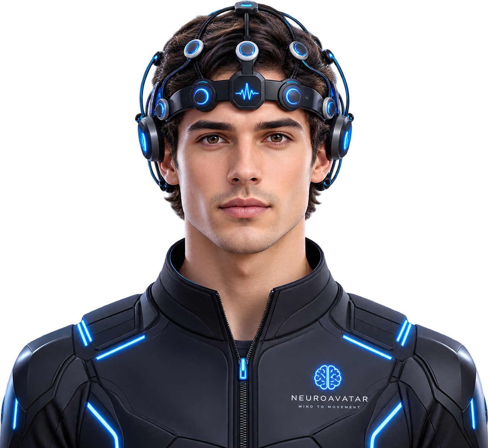

<p align="center">
  
</p>

<h1 align="center">NeuroAvatar</h1>

<p align="center">
  <strong>Your Mind. Your Movement. Your Second Body.</strong>
</p>

<p align="center">
  <em>A brain-computer interface platform that enables humans to control humanoid robots through motor intention — transforming robotics into physical extensions of the human body.</em>
</p>

<p align="center">
  <a href="#-live-demo">Live Demo</a> •
  <a href="#-architecture">Architecture</a> •
  <a href="#-sections--features">Sections</a> •
  <a href="#-design-system">Design System</a> •
  <a href="#-animations">Animations</a> •
  <a href="#-tech-stack">Tech Stack</a> •
  <a href="#-deployment">Deployment</a>
</p>

---

## 🧠 Overview

NeuroAvatar is a **research-grade interactive web platform** that showcases the future of human-robot teleoperation through brain-computer interfaces (BCI). The application presents a comprehensive investor and research information portal featuring:

- **14 immersive content sections** with scroll-triggered animations
- **Dual-theme system** (Deep Space Dark / Crystal Ivory Light) with seamless live switching
- **Real-time interactive elements** — parallax, magnetic buttons, GSAP choreography
- **Simulated BCI telemetry pipeline** visualization
- **Mobile-first responsive design** with touch optimizations

> **Note**: All demonstrations are simulated. This platform is for research communication and investor information purposes.

---

## 🚀 Live Demo

Deploy to Vercel in one click or run locally:

```bash
# Clone & install
git clone https://github.com/your-org/NeuroAvatar.git
cd NeuroAvatar
npm install

# Development server (hot reload)
npm run dev

# Production build
npm run build
npm run preview
```

---

## 🏗 Architecture

```
NeuroAvatar/
├── public/                    # Static assets (logo, OG images)
├── src/
│   ├── components/
│   │   ├── features/          # 14 section components
│   │   │   ├── HeroSection.tsx
│   │   │   ├── ProblemSection.tsx
│   │   │   ├── BigIdeaSection.tsx
│   │   │   ├── NotAnAISection.tsx
│   │   │   ├── HowItWorksSection.tsx
│   │   │   ├── DemoSection.tsx
│   │   │   ├── NeuralDecoderSection.tsx
│   │   │   ├── TwowaySection.tsx
│   │   │   ├── RoadmapSection.tsx
│   │   │   ├── ApplicationsSection.tsx
│   │   │   ├── ResearchSection.tsx
│   │   │   ├── MarketSection.tsx
│   │   │   ├── InvestorSection.tsx
│   │   │   └── ClosingSection.tsx
│   │   ├── layout/            # Navbar, ThemeProvider
│   │   └── ui/                # Shadcn/UI primitives
│   ├── hooks/                 # useTheme, useInView
│   ├── pages/                 # Index, NotFound
│   ├── App.tsx                # Root with providers
│   ├── index.css              # Design system + animations
│   └── main.tsx               # Entry point
├── index.html                 # SEO-optimized shell
├── vercel.json                # Vercel deployment config
├── tailwind.config.ts         # Tailwind configuration
├── tsconfig.app.json          # TypeScript config
└── vite.config.ts             # Vite bundler config
```

---

## 📖 Sections & Features

| # | Section | Description | Key Interactions |
|---|---------|-------------|------------------|
| 1 | **Hero** | Kinetic headline with typewriter subtitle | Mouse parallax, magnetic CTAs, continuous glow/shimmer animations, floating particles |
| 2 | **Problem** | Why current robotics interfaces fail | 4 animated bottleneck cards, comparison matrix |
| 3 | **Big Idea** | The NeuroAvatar paradigm shift | Scroll-triggered reveals, gradient text |
| 4 | **Not An AI** | Motor intention vs. AI command distinction | Flip cards with front/back comparison, VS divider |
| 5 | **How It Works** | 5-stage BCI pipeline walkthrough | Step-by-step reveal, signal flow animation |
| 6 | **Demo** | Simulated BCI telemetry pipeline | Mesh character visualization, one-way signal transmission |
| 7 | **Neural Decoder** | EEG → kinematics signal processing | Raw EEG image, technical processing cards |
| 8 | **Two-Way** | Bidirectional feedback loop | Animated transmission pathways |
| 9 | **Roadmap** | Development milestones timeline | Interactive modal detail views |
| 10 | **Applications** | Use cases across verticals | Expandable application cards |
| 11 | **Research** | Academic foundation & citations | Publication cards with links |
| 12 | **Market** | TAM/SAM/SOM market analysis | Animated counters, data visualizations |
| 13 | **Investor** | Executive investment brief | 6-stage telemetry pipeline, platform expansion cards, deck request form |
| 14 | **Closing** | Brand signature & manifesto | Semi-opaque logo watermark, atmospheric aura, return-to-top |

---

## 🎨 Design System

### Color Palette

#### Dark Theme — *Deep Space + Ember + Electric Violet*

| Token | HSL | Usage |
|-------|-----|-------|
| `--background` | `222 35% 4%` | Deep obsidian base |
| `--foreground` | `38 18% 93%` | Warm ivory text |
| `--primary` | `38 92% 54%` | Amber/gold accent |
| `--secondary` | `258 80% 62%` | Electric violet |
| `--neural-cyan` | `38 92% 54%` | Primary interactive color |
| `--neural-violet` | `258 80% 62%` | Secondary accent |
| `--neural-blue` | `210 100% 60%` | Tertiary accent |
| `--surface-1..4` | `222 35-22% 4-14%` | Layered surface hierarchy |

#### Light Theme — *Crystal Ivory + Deep Amber + Regal Violet*

| Token | HSL | Usage |
|-------|-----|-------|
| `--background` | `36 28% 91%` | Warm ivory canvas |
| `--foreground` | `222 45% 5%` | Near-black text |
| `--primary` | `38 88% 36%` | Deep amber |
| `--secondary` | `258 70% 42%` | Regal violet |
| `--neural-cyan` | `38 85% 32%` | Deep amber interactive |

### Typography

| Font | Weight | Usage |
|------|--------|-------|
| **Outfit** | 300–900 | Headlines, CTAs, wordmarks |
| **Inter** | 300–600 | Body text, descriptions |
| **IBM Plex Mono** | 400–600 | Technical labels, metrics, code |

### Gradient Systems

```css
/* Tri-color gradient text */
.gradient-text-tri → cyan → violet → blue

/* Shimmer text (animated) */
.shimmer-text → sweeping gradient across neural-cyan, neural-glow, foreground, violet

/* Dynamic gradient (theme-adaptive) */
.gradient-text-dynamic → #00d4ff → #b872ff → #e0c2ff (dark)
                        → #0284c7 → #6d28d9 → #4338ca (light)
```

### Glass Morphism

```css
.glass-panel      → frosted card with backdrop blur + subtle border
.glass-panel-bright → elevated glass with stronger opacity
```

---

## ✨ Animations

### Scroll Animations (GSAP + ScrollTrigger)
- **Section entrance**: Fade-in with directional slide (alternating left/center/right)
- **Glass panel reveal**: Scale-up with opacity transition
- **Divider lines**: Draw-in from left with `scaleX` animation
- **Scroll progress bar**: Fixed top indicator tracking page progress

### Hero Section Animations
| Animation | Type | Details |
|-----------|------|---------|
| Headline reveal | GSAP Timeline | Lines stagger in with `skewY`, `rotateX`, `power4.out` easing |
| Typewriter | JavaScript interval | 18ms per character with blinking cursor |
| Parallax | Mouse tracking | Multi-layer depth (aurora orbs, grid, logo, content) |
| Floating particles | CSS `@keyframes` | 50 particles with randomized sizes, colors, durations |
| Aurora orbs | CSS animation | Soft pulsating gradient orbs with mouse parallax |
| Logo watermark | CSS mask | Centered semi-opaque (`0.18`/`0.13`) with radial feather mask |
| Primary CTA | Continuous | Glow pulse + shimmer sweep + bottom bar pulse |
| Secondary CTA | Continuous | Border breathe + blinking dot indicator |
| Magnetic buttons | GSAP | Cursor-following translation with elastic snap-back |

### Section-Specific Animations
| Section | Animation |
|---------|-----------|
| Problem | Bottleneck card hover transforms |
| Not An AI | 3D flip cards with backface diagrams |
| Demo | One-way signal transmission with mesh characters |
| Neural Decoder | Step-by-step processing pipeline reveal |
| Roadmap | Modal open/close with centered positioning |
| Investor | 6-node telemetry pipeline with live throughput beam |
| Closing | Background logo fade-in with scale transition, orbital rings |

### Global Animation Keyframes
```
shimmer, hero-orbit-spin, hero-orbit-spin-reverse, hero-aura-pulse,
hero-logo-scan, hero-btn-glow, hero-btn-shimmer, hero-btn-bar-pulse,
hero-btn-border-breathe, hero-btn-dot-blink, closing-pulse-ring,
pipeline-beam, count-up, blink, float-particle, scan-line,
aurora-orb-drift, glow-pulse, dot-flow, node-pulse, red-decay
```

---

## 🛠 Tech Stack

### Core Framework
| Technology | Version | Purpose |
|------------|---------|---------|
| **React** | 18.3 | UI component framework |
| **TypeScript** | 5.5 | Type-safe development |
| **Vite** | 5.4 | Lightning-fast HMR bundler |

### Styling & Design
| Technology | Purpose |
|------------|---------|
| **Tailwind CSS** 3.4 | Utility-first CSS framework |
| **Shadcn/UI** | Accessible component primitives (Radix UI) |
| **Custom CSS** | Design system, animations, gradient systems |

### Animation
| Technology | Purpose |
|------------|---------|
| **GSAP** 3.15 | ScrollTrigger, timeline choreography, magnetic effects |
| **Framer Motion** 12.x | Component-level transitions |
| **CSS Keyframes** | Continuous ambient animations |

### 3D & Visualization
| Technology | Purpose |
|------------|---------|
| **Three.js** 0.181 | 3D scene rendering |
| **React Three Fiber** 8.18 | React bindings for Three.js |
| **React Three Drei** 9.122 | Helper components for R3F |
| **Chart.js** / **Recharts** | Data visualizations |

### State & Data
| Technology | Purpose |
|------------|---------|
| **Zustand** 5.0 | Lightweight state management |
| **React Query** 5.x | Server state & caching |
| **React Router** 6.x | Client-side routing |
| **React Hook Form** + **Zod** | Form validation |

### Infrastructure
| Technology | Purpose |
|------------|---------|
| **Vercel** | Deployment & edge CDN |
| **PostCSS** + **Autoprefixer** | CSS processing pipeline |
| **ESLint** | Code quality |

---

## 📱 Mobile Compatibility

The application is fully responsive across all device sizes:

| Breakpoint | Target | Optimizations |
|------------|--------|---------------|
| `≤ 480px` | Small phones | Scaled typography, stacked CTAs, reduced particle opacity |
| `481–768px` | Tablets | Balanced scaling, wrapped layouts |
| `769–1024px` | Small laptops | Proportional heading sizes |
| `≥ 1025px` | Desktop | Full experience with all animations |

### Touch Optimizations
- **44px minimum tap targets** for all interactive elements
- **Disabled magnetic hover effects** on touch devices
- **`prefers-reduced-motion`** respected for accessibility
- **Safe area padding** for notched devices (iPhone, etc.)

---

## 🌐 Deployment

### Vercel (Recommended)

1. **Connect your repository** to [Vercel](https://vercel.com)
2. Vercel auto-detects the Vite framework via `vercel.json`
3. Settings are pre-configured:
   - **Build Command**: `npm run build`
   - **Output Directory**: `dist`
   - **SPA Rewrites**: All routes → `index.html`
   - **Asset Caching**: Immutable hashed assets cached for 1 year
   - **Security Headers**: `X-Content-Type-Options`, `X-Frame-Options`, `X-XSS-Protection`

### Manual Deployment

```bash
# Build production bundle
npm run build

# Preview locally
npm run preview

# The dist/ folder is ready for any static hosting
```

---

## 🔒 SEO & Performance

- **Meta tags**: Title, description, keywords, Open Graph, Twitter Cards
- **Structured data**: JSON-LD schema for WebSite
- **Semantic HTML**: Proper heading hierarchy, landmark elements
- **Font optimization**: Preconnect to Google Fonts, display=swap
- **Asset optimization**: Vite's tree-shaking, code splitting, hashed filenames
- **Favicon**: Custom logo as favicon and Apple touch icon

---

## 📄 License

This project is proprietary. All rights reserved by NeuroAvatar.

---

<p align="center">
  <strong>NeuroAvatar</strong> — The body is only the beginning.
</p>
